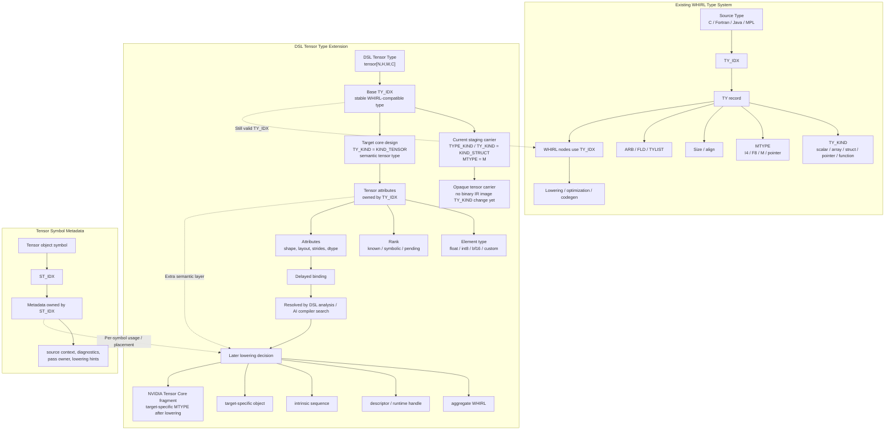

# Very High Level WHIRL DSL Infrastructure

This note defines a conservative path for adding very-high-level WHIRL
features for domain-specific languages and AI-assisted compiler front ends.
The goal is to let a new front end preserve domain intent long enough for a
dedicated lowering pass to consume it, without changing the stable WHIRL
operator enum or breaking existing WHIRL readers.

Architecture-independent optimization, parallelization, VHO-level Preopt/IPA,
and compiler-library codesign are planned separately in
`doc/VHO-DSL-OPTIMIZATION-PLAN.md`. This infrastructure plan owns the native
representation, mapped binary image, inspection, gatekeeper, compatibility,
and final VHO lowering boundary.

CNN domain meaning, including the proposed `cnn.bottleneck.v1` contract and
its relationship to PyTorch source structure, is documented separately in
`doc/DSL-WHIRL-CNN-REGION-CONTRACTS.md`.

## Design goals

1. Keep existing WHIRL binary compatibility unless a feature explicitly needs a
   new WHIRL version.
2. Let DSL front ends create very-high-level WHIRL that keeps source-level
   intent before the code is forced into scalar C/Fortran-like WHIRL.
3. Make unhandled DSL intent visible and debuggable instead of silently losing
   it.
4. Lower all DSL markers before WOPT, LNO, CG, and other phases that expect
   canonical WHIRL.

## Extension marker

DSL front ends can attach structured metadata with `OPR_COMMENT` nodes using
the reserved prefix:

```text
__WHIRL_DSL__:<domain>:<feature>:<payload>
```

The common WHIRL API exposes helpers in `osprey/common/com/wn.h`:

```c++
WN *WN_Create_DSL_Comment (const char *domain,
                        const char *feature,
                        const char *payload);
WN *WN_Create_DSL_Assert (const char *domain,
                       const char *condition,
                       const char *message);
BOOL WN_Is_DSL_Comment (const WN *wn);
BOOL WN_Is_DSL_Assert (const WN *wn);
const char *WN_Get_DSL_Comment_Payload (const WN *wn);
```

Older components see the marker as a normal comment.  DSL-aware components
should treat it as a required lowering contract.  The payload is intentionally
opaque at this layer; a DSL-specific pass can use JSON, S-expression text, a
symbol-table key, or another stable mini-format.  `WN_Get_DSL_Comment_Payload`
returns the text after `<domain>:<feature>:`; passes that need the domain and
feature can read the full comment string through `WN_GetComment`.

## Non-Comment DSL Opcode Value Carrier

The carrier for frontend-created DSL opcode values is no longer a physical
`OPR_COMMENT`.  Carrier migration is intentionally per opcode.  Unmigrated
builder operators still use the binary-compatible `OPR_EVAL` staging shape:

```text
OPR_EVAL
  OPR_LDA string constant "__WHIRL_DSL__:opcode:<name>:v<version>:<payload>"
```

Operators with operands use an envelope that still preserves the fixed
one-child shape:

```text
OPR_EVAL
  OPR_COMMA
    OPR_BLOCK
      OPR_EVAL
        OPR_LDA string constant "__WHIRL_DSL_OPERAND__:kid0:opcode=...:version=...:payload=..."
      OPR_EVAL
        OPR_LDA string constant "__WHIRL_DSL_OPERAND__:kid1:opcode=...:version=...:payload=..."
    OPR_LDA string constant "__WHIRL_DSL__:opcode:<name>:v<version>:<payload>"
```

A non-comment, non-`OPR_EVAL` staging carrier is also available:

```text
OPR_XPRAGMA
  OPR_COMMA
    OPR_BLOCK
      OPR_XPRAGMA
        OPR_LDA string constant "__WHIRL_DSL_OPERAND__:kid0:opcode=...:version=...:payload=..."
      OPR_XPRAGMA
        OPR_LDA string constant "__WHIRL_DSL_OPERAND__:kid1:opcode=...:version=...:payload=..."
    OPR_LDA string constant "__WHIRL_DSL__:opcode:<name>:v<version>:<payload>"
```

`DSL_WN_Create_Opcode_Xpragma` creates this non-eval carrier.  It uses
`WN_PRAGMA_UNDEFINED` only as an internal staging tag; the authoritative DSL
identity remains the `__WHIRL_DSL__:opcode:...` record.  This avoids adding a
new WHIRL opcode, pragma enum, WN field, ELF section, or binary IR version in
this stage.

The first builder migration slice moved `common.tensor_const` and `common.add`
to the XPRAGMA carrier.  The second slice moves `common.matmul`.  These common
operators now use XPRAGMA for both their outer carrier and operand-evidence
statements.  Carrier selection remains an implementation detail behind the
opaque `DSL_BUILDER_VALUE` API.
Operand-evidence statements follow their outer carrier: migrated XPRAGMA
operators contain no EVAL nodes, while unmigrated EVAL operators retain their
original EVAL evidence statements.  The decoder accepts both forms during the
migration.  Compatibility tests construct the legacy EVAL form explicitly
through `DSL_WN_Create_Opcode_With_Operands`; production common operators no
longer need to remain on EVAL solely to exercise that input path.

The operand helper records are inspection evidence for the staged carrier.
They do not use the `__WHIRL_DSL__:` opcode prefix and therefore are not
counted as independent unlowered DSL opcodes by the VHO scanner.
DSL-aware verifier and lowering code should inspect them through
`DSL_WN_Decode_Opcode_Operand_Record`, not by parsing `fdump_tree` output.
Before lowering a non-comment DSL node, passes should call
`DSL_WN_Verify_Opcode_Carrier` to reject malformed carrier shapes and
malformed operand records.
The VHO unconsumed-DSL scanner also reports malformed carrier counts, so
pre-lowering diagnostics can distinguish "valid but unlowered" DSL values from
broken staged carriers.

The carrier node is the opaque `DSL_BUILDER_VALUE` seen by Python and other
frontends.  The string record preserves stable opcode name, version, operands,
attributes, and payload/result metadata in the same parseable format as the
legacy marker.

Binary reader/writer behavior is intentionally unchanged for this stage.  The
carriers remain ordinary `OPR_EVAL`, `OPR_XPRAGMA`, `OPR_COMMA`, `OPR_BLOCK`,
and `OPR_LDA` tree entries, and their records remain ordinary constant/string
table entries in the mapped WHIRL image.  They do not add a WHIRL `OPERATOR`,
opcode enum value, WN field, ELF section, or new binary IR image table.

Compatibility input remains explicit.  `DSL_WN_Create_Opcode_Marker` creates
the old annotated `OPR_COMMENT` marker, and `DSL_WN_Get_Opcode_Annotation`
accepts both carriers during migration.  Dumps distinguish them with stable
carrier text:

```text
dsl_node=common.add.v1 dsl_carrier=eval_lda_string dsl_operand_count=2
dsl_node=common.add.v1 dsl_carrier=xpragma_lda_string dsl_operand_count=2
dsl_opcode=common.add.v1 dsl_carrier=comment_marker
```

Frontend code must continue to treat `DSL_BUILDER_VALUE` as opaque.  Both the
current `OPR_EVAL` and `OPR_XPRAGMA` carriers are binary-compatible staging
representations, not promises about the final native WHIRL DSL opcode layout.

## Compatibility Migration Policy

`DSL_WN_Get_Logical_Opcode()` is the carrier-independent semantic entry point.
It accepts native nodes and legacy `OPR_COMMENT`, `OPR_EVAL`, and
`OPR_XPRAGMA` records, then returns the logical operator, source version,
effective version, payload, carrier classification, and version disposition.
Compiler code that needs executable DSL semantics should use this accessor
instead of branching on the physical carrier.

Version handling is deterministic and conservative.  An exact registered
version is accepted.  Older versions, newer versions, and unknown stable names
receive distinct rejection dispositions.  No version is silently upgraded.
`DSL_OPCODE_VERSION_MIGRATED` is reserved for a future operator-specific
migration routine that validates and rewrites the old schema; merely changing
the version number will never constitute migration.

`DSL_WN_Create_Logical_Opcode()` provides explicit output modes for native,
legacy EVAL, legacy XPRAGMA, and comment-projection output.  EVAL and XPRAGMA
retain legacy operand records.  COMMENT remains a high-level projection and
does not carry operand records.  A producer targeting an older tool must choose
the compatibility form during construction.  It must not remove `.WHIRL.dsl`,
rewrite the revision string, or otherwise relabel an artifact that still
contains native DSL nodes as baseline `WHIRL::0.33`.

## Compatibility Comment Projection

The `OPR_COMMENT` view remains a required compatibility and inspection
projection until the project explicitly retires it.  Even after a native WHIRL
DSL node is introduced, `ir_b2a` should continue to expose a high-level comment
record such as:

```text
COMMENT "__WHIRL_DSL__:opcode:common.add:v1:kid0=...;kid1=...;attr.broadcast_rule=none"
```

This comment projection is not the authoritative long-term carrier.  It is a
stable human-readable and tool-friendly summary of the DSL operator.  It lets
older tools, reviewers, DSL authors, and `ir_a2b` / `ir_b2a` round-trip tests
inspect high-level intent while the native DSL node representation matures.

Retiring this projection requires an explicit design decision.  Until then,
new native DSL node work must preserve enough information to regenerate the
comment projection from the same logical DSL node record used by the native
carrier.

## Logical DSL Node Record

All physical carriers must decode to the same logical `DSL_WHIRL_NODE_RECORD`.
This record is the compatibility contract between the current staging carrier,
the compatibility comment projection, and a future native WHIRL DSL node.

The record contains:

1. Stable opcode name.
2. Opcode version.
3. Payload string carrying operands, attributes, and result metadata.
4. Carrier kind for diagnostics and migration visibility.

The current APIs are:

```c++
BOOL DSL_WN_Decode_Opcode_Record(const WN *wn,
                                 DSL_WHIRL_NODE_RECORD *record);
WN *DSL_WN_Create_Opcode_From_Record(const DSL_WHIRL_NODE_RECORD *record);
WN *DSL_WN_Create_Opcode_With_Operands(const char *name,
                                       UINT32 version,
                                       const char *payload,
                                       WN **operands,
                                       UINT32 operand_count);
WN *DSL_WN_Create_Opcode_Xpragma(const char *name,
                                 UINT32 version,
                                 const char *payload,
                                 WN **operands,
                                 UINT32 operand_count);
WN *DSL_WN_Create_Opcode_Marker_From_Record(
        const DSL_WHIRL_NODE_RECORD *record);
WN *DSL_WN_Create_Opcode_Comment_Projection(const WN *wn);
UINT32 DSL_WN_Opcode_Operand_Count(const WN *wn);
BOOL DSL_WN_Decode_Opcode_Operand_Record(
        const WN *wn,
        UINT32 operand_index,
        DSL_WHIRL_OPERAND_RECORD *record);
BOOL DSL_WN_Verify_Opcode_Carrier(const WN *wn, FILE *diagnostic);
BOOL DSL_WN_Opcode_Records_Equivalent(
        const DSL_WHIRL_NODE_RECORD *record0,
        const DSL_WHIRL_NODE_RECORD *record1);
void DSL_fprint_opcode_comment_projection(FILE *f, const WN *wn);
```

The builder boundary exposes equivalent operand inspection without exposing WN
layout to frontends:

```c++
UINT32 DSL_Builder_Count_Value_Operands(DSL_BUILDER_VALUE value);
BOOL DSL_Builder_Get_Value_Operand(DSL_BUILDER_VALUE value,
                                   UINT32 operand_index,
                                   DSL_BUILDER_VALUE_INFO *info);
```

Before replacing the `OPR_EVAL` transition with a native WHIRL DSL node, tests
must prove:

1. The `OPR_EVAL` carrier decodes to the record.
2. The `OPR_COMMENT` compatibility marker decodes to an equivalent record.
3. A native DSL node created from the same record decodes to an equivalent
   record.
4. `ir_b2a` can still print stable DSL node evidence and the compatibility
   comment projection.

## DSL Framework Usability Goal

The DSL WHIRL framework should make adding a new DSL operator and, later, a
native WHIRL DSL node smooth, repeatable, and well documented.  The goal is for
new DSL authors to extend Open64 through this framework without reverse
engineering scattered compiler conventions or depending on an external IR
stack.

The design documents, `AGENTS.md`, and future `SKILL.md` guidance are part of
the implementation strategy.  They should capture the repeatable steps,
compatibility rules, required tests, printing expectations, and migration
points clearly enough that new DSL work can follow the same path.

The long-term project direction is to make DSL WHIRL the primary Open64 DSL
path for AI-era compiler construction, without any dependence on MLIR for DSL
compiler development.  That requires preserving Open64 binary compatibility
while making the DSL extension workflow easier to use, easier to validate, and
better integrated with Open64 tools.

`WN_Create_DSL_Assert` is a convenience wrapper for simple pre-lowering
assertions.  It creates a DSL marker with feature `assert`, not a canonical
`OPR_ASSERT` node.  A DSL-aware validation or lowering pass must consume the
marker before canonical optimization.  This lets a frontend state facts that
must hold before lowering, such as resolved tensor shape, compatible operand
types, or concrete stack storage size.

## Recommended lowering pipeline

1. A DSL or AI frontend builds very-high-level WHIRL by combining legal High
   WHIRL executable fallback nodes with DSL markers next to the WHIRL region,
   statement, or expression group they describe.  The frontend must set
   `PU_HAS_VERY_HIGH_WHIRL` on any PU that contains these markers.
2. A VHO-adjacent DSL lowering pass scans for DSL opcode values with
   `DSL_WN_Has_Opcode` and for generic DSL comments with `WN_Is_DSL_Comment`.
3. The pass validates the `<domain>` and `<feature>` fields and either:
   - replaces the marked region with canonical WHIRL,
   - rewrites it to target intrinsics/runtime calls, or
   - reports a fatal diagnostic if the marker is required but unsupported.
4. After successful lowering, the pass removes or rewrites consumed DSL markers
   to ordinary debug comments.
5. Standard VHO lowering runs on canonical WHIRL.

## Encoding examples

Tensor DSL:

```text
__WHIRL_DSL__:tensor:fused_op:{"op":"matmul_bias_relu","layout":"nhwc"}
__WHIRL_DSL__:tensor:assert:shape(temp_var)==shape(a):tensor add result shape must be resolved
```

Scheduling DSL:

```text
__WHIRL_DSL__:schedule:tile:{"i":64,"j":32,"vectorize":"j"}
```

AI compiler search hint:

```text
__WHIRL_DSL__:ai:search_space:{"unroll":[1,2,4,8],"cost":"latency"}
```

## MPL Reference Boundary

MPL is not a Very High Level WHIRL ingestion path and does not provide an
equivalent Very High Level WHIRL feature set.  MPL-related sources may be used
only as reference material for porting another IR roughly equivalent to Middle
Level WHIRL.  They should not guide the DSL frontend, Python ingestion, or
non-comment DSL node design.

## Tensor Type Extensions

Tensor is represented first as a DSL type extension attached to an existing
`TY_IDX`, not as a new WHIRL operator or a new binary IR image `TY_KIND`.  This
keeps the core symbol-table layout stable while the tensor type system is still
being designed.  The current carrier type uses `TY_KIND = KIND_STRUCT` with
`MTYPE_M`; tensor identity and delayed attributes live in the tensor extension
side table.

Tensor extension records should follow the existing WHIRL table discipline:
fixed-size records indexed by integer handles.  Do not place nested STL
containers such as `std::vector` or `std::map` inside a table record that may
later need to be dumped, reloaded, compared, or moved into a binary IR image.
Variable attributes and metadata should live in separate key/value table
entries and be linked from their owning records through table indices,
mirroring the way WHIRL uses companion tables such as `TY`, `FLD`, `ARB`, and
`TYLIST`.

Tensor attributes and compiler metadata intentionally have different owners.
Attributes are TensorDescriptorIR-completing facts associated with `TY_IDX`:
they describe semantic tensor value state such as TensorTypeCore, TensorTraitSet,
TensorRepresentationDescriptor, and TensorLineageMetadata.  Required attributes
must be complete before tensor computation, verification, or lowering can rely
on the tensor descriptor.  Metadata is compiler context associated with `ST_IDX`
or a use site: source context, diagnostics, pass ownership, lowering hints, and
profile data.  Adding or changing compiler metadata must not create a new tensor
type and must not participate in tensor type equivalence unless a later schema
explicitly promotes the fact into tensor attributes.

The `TY_tensor_*` and `ST_tensor_*` APIs are intentionally global
`common/com` entry points, grouped by Open64-style prefixes rather than by a
new C++ namespace.  This keeps the symbol-table and type-table additions
callable from older Open64 code without forcing a namespace migration through
frontends, IPA, backends, and IR tools.  A future C++ namespace facade may be
added in a leaf DSL component, but it should wrap these stable global APIs
rather than replace them.

The agreed long-term direction is to promote tensor into the core WHIRL type
system as `TY_KIND = KIND_TENSOR`, because tensor is common across many DSLs and
domains.  That common tensor type should carry semantic information such as
element type, rank, shape, layout, and strides.  It should not require a
general `MTYPE_TENSOR` at the source/DSL level, because `MTYPE` is normally tied
to target-machine values.

Target-specific tensor machine types are still legitimate after lowering.  For
example, NVIDIA Tensor Core lowering may introduce a target-specific `MTYPE`
for a WMMA/MMA matrix fragment or accumulator fragment.  That target type is
not the same thing as the common DSL tensor type; it is the hardware-level
representation selected after shape, layout, and target legality are known.



The type-system interface is declared in `osprey/common/com/symtab.h`:

```c++
TY_IDX TY_Create_Tensor_Extension_Type(const char *name,
                                       TY_IDX element_ty,
                                       INT32 rank);
void TY_Mark_Tensor_Extension(TY_IDX ty, TY_IDX element_ty, INT32 rank);
BOOL TY_is_tensor_extension(TY_IDX ty);
BOOL TY_Get_Tensor_Extension_Info(TY_IDX ty,
                                  TY_TENSOR_EXTENSION_INFO *info);
TY_IDX TY_tensor_element_ty(TY_IDX ty);
INT32 TY_tensor_rank(TY_IDX ty);
```

Type attributes can be declared before final values are known, then bound later
by type inference, DSL analysis, or an AI compiler search stage:

```c++
TY_tensor_declare_attribute(tensor_ty, "shape");
TY_tensor_declare_attribute(tensor_ty, "layout");

/* Later, after DSL type analysis has resolved the facts. */
TY_tensor_bind_attribute(tensor_ty, "shape", "[1,224,224,3]");
TY_tensor_bind_attribute(tensor_ty, "layout", "NHWC");
```

Suggested attribute keys include `shape`, `rank`, `layout`, `dtype`,
`strides`, `sparsity`, `quantization`, and `memory_space`.

Compiler metadata uses a separate `ST_IDX` API:

```c++
ST_tensor_declare_metadata(tensor_st, "source_layer_name");
ST_tensor_declare_metadata(tensor_st, "lowering_hint");

/* Later, after source import or pass planning has resolved the facts. */
ST_tensor_bind_metadata(tensor_st, "source_layer_name", "encoder.block0.add");
ST_tensor_bind_metadata(tensor_st, "lowering_hint", "prefer_vector");
```

Suggested metadata keys include `source_context`, `source_layer_name`,
`diagnostic_owner`, `pass_owner`, `lowering_hint`, and `profile_data`.  These
names are conventions at this layer; a later tensor schema can standardize them
without changing the storage interface.

WHIRL generation should remain delayed.  A frontend can create or mark tensor
types and bind attributes incrementally, while VHO or a future DSL lowering pass
decides later whether a tensor becomes an aggregate, descriptor, runtime handle,
intrinsic call sequence, or target-specific object.

## When to add real WHIRL operators

Use these markers for early infrastructure, experiments, source intent, and
features that can be lowered before canonical optimization.  Add real WHIRL
operators only when the feature must participate directly in common
optimizers, dependence analysis, alias analysis, or code generation.  In that
case update the operator enum, opcode table, ASCII reader/printer, binary IR
image reader/writer, dumps, simplifier tables, WHIRL-to-source tools, and every
phase that asserts operator coverage.

## Native DSL WHIRL bring-up plan

Status convention:

- `[x]` completed and validated.
- `[ ] (active)` current implementation item.
- `[ ]` queued in dependency order.

The production builder still emits compatibility carriers.  Native construction
is an exercised vertical slice, not yet the default artifact path.

### Design contracts

### Logical DSL operator abstraction

Compiler developers work with logical operators such as `OPR_DSLADD`,
`OPR_DSLMATMUL`, and `OPR_DSLTENSORCONST`.  Construction, inspection,
verification, lowering, ASCII dumps, and traces go through the logical APIs:

```c++
WN *DSL_WN_Create_Native(DSL_OPERATOR dsl_operator,
                         UINT32 version,
                         const char *payload,
                         WN **operands,
                         UINT32 operand_count);
DSL_OPERATOR DSL_WN_operator(const WN *wn);
const char *DSL_OPERATOR_name(DSL_OPERATOR dsl_operator);
```

For example, a pass tests `DSL_WN_operator(wn) == OPR_DSLADD`.  It must not
test the physical escape tag and then decode `WN_offset` itself.  `ir_b2a` and
internal traces print `OPR_DSLADD`, its semantic version, operands, attributes,
and result information.  They do not print `OPR_DSL`, `OPC_MDSL`, or the
internal record index.

This separation is an API contract.  Adding a logical DSL operator extends the
logical registry and its printer mapping without consuming another physical WN
operator slot or spreading decoding logic through compiler passes.

### Private physical escape contract

At the low-level WN storage boundary only, one generic, variable-arity
`OPR_DSL` expression acts as an escape tag.  Every DSL operator produces a
value.  Its physical layout is private to the logical accessor, mapped-image
reader/writer, and low-level verifier:

```text
WN_operator       OPR_DSL
WN_rtype          MTYPE_M
WN_desc           MTYPE_V
WN_kid_count      exact number of operand-reference kids
WN_offset         private DSL record reference
WN_kid(i)         operand-reference WHIRL tree
```

The node-record ID resolves an opcode-descriptor record containing the stable
opcode name and semantic version, plus the node attributes and result metadata.
The 14-bit `kid_count` field is used only as a count.  Its high bits must not be
reused for flags, versions, or table IDs because generic WHIRL allocation,
copying, traversal, and mapped-image logic consume the complete count.

No DSL pass, frontend, diagnostic, ASCII dump, or ordinary trace may expose or
depend on this physical layout.

The native DSL expression does not own a result symbol or decide storage
allocation.  An enclosing assignment names the temporary result:

```text
STID temp
  OPR_DSLADD kid0, kid1
```

The temporary symbol has the tensor `TY_IDX`, associated tensor descriptor, and
the semantic symbol attribute `no_alias=true`.  DSL operator results have
unique memory ownership: the storage denoted by a live result symbol does not
overlap storage denoted by another live tensor symbol.  Allocation and physical
placement remain deferred until lowering, but ownership is complete before
computation and is available to DSL verification and optimization.

The special DSL tensor result temporary is represented without a new symbol
class.  It is a `CLASS_VAR` with `ST_IS_TEMP_VAR` set, a tensor `TY_IDX`, and
`no_alias=true`.  `DSL_Builder_Create_Tensor_Result_Symbol()` must establish all
four properties when declaring the left-hand side of the `STID`.  The result
role must never be inferred from its symbol name.

Like a CUDA/PTX virtual-register temporary, a very-high-level DSL result
temporary is non-addressable before lowering.  It may be defined by `STID` and
used by `LDID`, but it must not appear in `LDA`, be passed by address, or escape
through an address-bearing operation.  The DSL gatekeeper must reject such an
escape.  This makes `no_alias=true` a structural value contract rather than an
optimization hint.

Do not set baseline `ST_PT_TO_UNIQUE_MEM` directly on a `KIND_TENSOR` symbol.
Existing WSSA logic defines that flag for pointer-typed symbols and asserts the
pointer-type requirement.  When lowering materializes a pointer representation,
it must preserve `no_alias=true` and may translate it to
`ST_PT_TO_UNIQUE_MEM` under the existing pointer contract.

`OPR_DSL` is not executable canonical WHIRL.  The DSL gatekeeper and VHO
lowering must consume it before WOPT, LNO, or CG.  Compatibility comment
projection remains required until an explicit decision retires it.

### First executable tensor representation

The first target-independent lowering route is a versioned opaque runtime
handle ABI.  This is a lowering decision, not an ingestion representation.
Very-high-level WHIRL continues to carry first-class logical operators and
tensor descriptors through gatekeeper and target-independent DSL analysis.
Only the VHO-adjacent DSL lowering pass introduces runtime calls.

Each verified tensor result maps to a distinct pointer-sized PREG containing an
`OPEN64_DSL_TENSOR_HANDLE`.  The PREG is non-addressable and therefore retains
the virtual-register behavior of the very-high-level result temporary.  The
runtime call contract promises a distinct owning handle for every successful
result, preserving `no_alias=true`; a null handle denotes runtime failure.  The
compiler does not allocate tensor data or select physical placement in this
first route.  Runtime allocation, placement, and reclamation remain runtime
policy.

`osprey/include/open64_dsl_runtime_abi.h` defines ABI version 1.  Its tensor
descriptor has a fixed 64-byte header followed by optional signed 64-bit shape
and stride arrays.  Array locations are relative byte offsets from the start of
the descriptor blob, not process-local pointers.  Numeric dtype, layout,
memory, broadcast, matmul flag, and ownership values are append-only contracts;
zero means unspecified where applicable.  Sharding, placement, quantization,
and runtime-state fields remain numeric schema IDs and must be zero until their
registries are defined.

The first call surface is:

```c
__open64_dsl_tensor_const_v1(result_descriptor, scalar_value)
__open64_dsl_add_v1(kid0, kid1, result_descriptor, broadcast_rule)
__open64_dsl_matmul_v1(kid0, kid1, result_descriptor, matmul_flags)
```

These functions return opaque handles.  No frontend or Python API exposes
them, and no backend code enters torch2whirl.  A release/lifetime ABI is
intentionally deferred until graph output ownership and liveness policy are
defined; lowering must not insert speculative releases.

The checked-in opcode tables contain legacy target operators that the current
`opcode_gen` script does not reproduce.  The first native slice assigns
`OPR_DSL` the common value 148 on every target and leaves reserved gaps after
the existing target-specific ranges.  Before full opcode-table regeneration,
reconcile those existing target additions with the generator and prove that all
previously assigned operator values remain unchanged.

### Fixed-row mapped-image table contract

The source-level DSL image model uses append-only, 1-based table IDs.  ID zero
is invalid; the tables do not reserve empty rows or encode optional state with
holes.  Rows contain only explicitly sized scalars, table IDs, `TY_IDX`,
`ST_IDX`, and `STR_IDX`.  They contain no pointers, STL containers, ownership,
or process-local object references.

The first table set is:

- `DSL_IR_IMAGE_HEADER`, 48 bytes: version, capabilities, flags, and row counts.
- `DSL_IR_OPCODE_DESCRIPTOR_RECORD`, 72 bytes: logical operator identity,
  semantic version, operand contract, semantic models, and schema string IDs.
- `DSL_IR_NODE_RECORD`, 40 bytes: opcode descriptor, contiguous operand and
  attribute ranges, result value, flags, and compatibility payload string ID.
- `DSL_IR_ATTRIBUTE_RECORD`, 32 bytes: owner node, typed value kind, name and
  value string IDs, and flags.
- `DSL_IR_VALUE_RECORD`, 48 bytes: value role, tensor descriptor, producer,
  type, symbol, name, metadata string ID, and flags.
- `DSL_IR_VALUE_REFERENCE_RECORD`, 24 bytes: owner node, operand ordinal, and
  referenced value ID.

Construction appends rows and then finalizes a node's contiguous operand,
attribute, and result links through `DSL_IR_Image_Set_Node_Links()`.  Link
finalization validates table bounds, operand order, owner identity, logical
arity, and result provenance.  The next stage connects these rows to the
  existing ELF WHIRL mapped-image path.

### Optional ELF DSL image section

All fixed-row DSL tables occupy one optional `SHT_MIPS_WHIRL` section named
`.WHIRL.dsl` with `sh_info=WT_DSL_IR_IMAGE`.  The section contains the 48-byte
header followed by opcode descriptor, node, attribute, value, and value
reference rows in that order.  Every boundary is naturally 8-byte aligned and
the reader computes the exact expected section size from checked row counts.

The writer omits `.WHIRL.dsl` when every DSL table is empty, preserving legacy
output.  For `0.33` compatibility artifacts, existing readers ignore the
unknown optional section.  A DSL-aware
reader treats section absence as an empty image, but a present section must
have the supported version and capability set, exact size, valid string-table
IDs, sequential row IDs, valid ranges, matching owners and ordinals, supported
logical descriptors, and correct result provenance.  Validation completes
before mapped rows replace live tables.  Input cleanup detaches mapped rows
before the ELF mapping is released.

Legacy artifacts without native DSL nodes retain `WHIRL::0.33`.  An artifact
containing native DSL node rows uses `WHIRL::0.34` and must contain a valid,
nonempty `.WHIRL.dsl` section.  The DSL-aware reader accepts both revisions;
an older reader rejects `0.34` at the revision gate before it can traverse an
unknown physical operator.  This explicit revision boundary prevents native
`OPR_DSL` trees from being mislabeled as baseline binary WHIRL.

### Completed foundation

- [x] Add the append-only physical escape operator at value 148 without
  renumbering existing x86-64 WHIRL operators.
- [x] Define the native carrier as a variable-arity, value-producing `MTYPE_M`
  expression with direct operand kids.
- [x] Add the first logical operator names: `OPR_DSLTENSORCONST`,
  `OPR_DSLADD`, and `OPR_DSLMATMUL`.
- [x] Add logical construction and inspection APIs that hide the physical
  escape tag and private record reference.
- [x] Make native ASCII dumps and internal image traces show the logical
  operator rather than `OPR_DSL`, `OPC_MDSL`, or the private record index.
- [x] Define the special tensor result temporary as `CLASS_VAR` plus
  `ST_IS_TEMP_VAR`, tensor `TY_IDX`, and `no_alias=true`.
- [x] Preserve annotated `OPR_COMMENT`, `OPR_EVAL`, and `OPR_XPRAGMA` as
  compatibility inputs while the native path is brought up.
- [x] Add a native contract test for logical `OPR_DSLADD`, direct kids,
  expression classification, result `STID`, no-alias ownership, and hidden
  physical dump evidence.
- [x] Consolidate the first logical operator descriptors in the append-only
  common opcode seed.  `common.tensor_const`, `common.add`, and
  `common.matmul` now obtain their logical enum/name, stable name, semantic
  version, operand contract, attribute schema, shape rule, effect model,
  lowering model, and diagnostic prefix from one table-driven source.
- [x] Audit the historical `opcode_gen` boundary and add a physical operator
  compatibility matrix.  The matrix compiles both enum assertions and the
  real `OPERATOR_info` table for x86-64, MIPS, MIPS-SL, generic KEY, Loongson,
  and baseline configurations; it locks the existing extension slots,
  `OPR_DSL=148`, `OPERATOR_LAST=148`, and `OPC_MDSL`.
- [x] Define fixed-row DSL image tables for capability/header, logical opcode
  descriptors, logical nodes, typed operation attributes, values, and ordered
  value references.  Lock row sizes at compile time, use string-table and
  table IDs only, validate forward-link finalization, and establish the table
  contract before its ELF integration.
- [x] Connect the fixed rows to one optional `.WHIRL.dsl` section through the
  existing ELF WHIRL mapped-image writer and reader.  Omit empty images, load
  legacy files as empty tables, reject malformed or unsupported sections, and
  detach mapped rows before input cleanup.  Cover both section absence and a
  populated `common.add` write/open/map/read round trip.
- [x] Migrate the production builder's first vertical slice.  Native
  `common.tensor_const`, `common.add`, and `common.matmul` values are defining
  `STID` statements for no-alias tensor temporaries.  Their expression kids are
  logical DSL nodes and binary operands are direct `LDID` references.  The
  builder populates opcode, node, typed-attribute, value, and value-reference
  rows from the same construction call.  Non-migrated operators receive fresh
  compatibility projections when consuming native values, and all public
  dumps retain the high-level `OPR_COMMENT` projection.
- [x] Complete logical inspection in `ir_b2a` and `ir_b2a -st`.  Standard tree
  output names native expressions as `OPR_DSLTENSORCONST`, `OPR_DSLADD`, and
  `OPR_DSLMATMUL` with semantic versions, direct operands, payload, and comment
  projection.  The `-st` path prints the DSL image header plus opcode
  descriptor, node, typed attribute, value, and ordered value-reference tables.
  Value rows include tensor descriptor facts, result symbols, and `no_alias`
  ownership.  Neither form exposes `OPR_DSL`, `MDSL`, `OPC_MDSL`, nor the
  private WN record reference.
- [x] Add the first native DSL gatekeeper.  Common/com verifies the fixed image
  and native WN tree together before builder output, and VHO invokes the same
  verifier before F90 or VH lowering.  The gate rejects unsupported logical
  versions, operand-count or direct-`LDID` violations, missing typed static
  attributes, incomplete tensor cores, incompatible tensor operands or results,
  malformed result `STID` temporaries, missing `no_alias=true`, stale image
  nodes, duplicate definitions, and result-symbol use through `LDA` or a
  non-DSL `LDID`.  Rank-2 matmul construction and verification enforce
  `[M,K] x [K,N] -> [M,N]`.  A differently named builder PU starts a fresh DSL
  program/image so multiple compilations in one frontend process cannot leak
  records into each other.
- [x] Complete the first compatibility migration policy.  Native,
  `OPR_COMMENT`, `OPR_EVAL`, and `OPR_XPRAGMA` carriers resolve through
  `DSL_WN_Get_Logical_Opcode()`.  Exact versions are accepted; older, newer,
  and unknown versions receive stable rejection dispositions, with no implicit
  schema upgrade.  `DSL_WN_Create_Logical_Opcode()` selects native, legacy
  EVAL, legacy XPRAGMA, or comment-projection output explicitly.  Compatibility
  output is a construction decision; native `0.34` artifacts are never
  relabeled as baseline `0.33`.

### Active queue

10. [x] Add VHO native DSL lowering.

   Lower verified tensor-constant, add, and matmul nodes before canonical
   optimization while preserving tensor semantics, unique ownership,
   no-alias facts, source context, and version-specific behavior.

   - [x] Establish the dedicated `VHO_DSL_Lower_Driver()` as the DSL-specific
     peer of the existing language-oriented `VHO_Lower_Driver()`. It runs the
     DSL gatekeeper, the fixed-order optional DSL optimization pipeline, a
     post-optimization gatekeeper check, and the verified DSL lowering engine
     before F90/standard VHO lowering. It traverses
     native nodes through logical APIs only, leaves baseline WHIRL untouched,
     reports stable operator/version/lowering-model diagnostics, and prevents
     unsupported native nodes from leaking into canonical phases.
   - [x] Select and document a versioned opaque runtime-handle ABI as the first
     executable tensor representation.  Results map to distinct pointer-sized
     PREGs, descriptor blobs use a fixed 64-byte pointer-free header plus
     relative shape/stride offsets, and allocation/placement remain runtime
     policy.  The ABI choice is independent of the private WN carrier.
   - [x] Change `common.tensor_const`, `common.add`, and `common.matmul` from
     `marker_only` to `runtime_call` after defining the selected handle ABI.
     Their stable names, logical enum values, semantic versions, operand
     contracts, and physical WHIRL encoding remain unchanged.
   - [x] Implement topological rewrites for `common.tensor_const`,
     `common.add`, and `common.matmul`, preserving descriptor facts and mapping
     each unique no-alias result temporary into the selected representation.
     The first implementation emits versioned runtime calls in source order,
     captures each owning handle in a distinct pointer-sized PREG, and requires
     every operand to resolve to an earlier result PREG.  It materializes the
     fixed descriptor header, relative shape vector, and tensor-constant scalar
     as read-only WHIRL symbols.  Known representation fields are mapped to
     append-only runtime enums; nonempty unsupported values are rejected rather
     than discarded.  Source positions and literal `OPR_COMMENT` projections
     remain beside the lowered calls, while the original tensor symbol/type and
     compiler metadata tables remain available for diagnostics.
   - [x] Prove native and compatibility inputs produce equivalent lowered
     WHIRL, and prove no native DSL node reaches standard VHO, WOPT, LNO, or CG.
     The compatibility proof covers the representable version-1 subset for
     tensor constants and one-level add/matmul graphs.  Validated XPRAGMA, EVAL,
     and comment carriers are normalized from their stable payload identities
     and immediately use the native lowering engine.  Ambiguous chained legacy
     results, incomplete tensor cores, unknown versions, and unsupported
     operators are rejected rather than assigned inferred semantics.  A linked
     producer-style test compares normalized call names, parameter roles,
     dependency ordinals, static arguments, and retained-comment counts for
     native and mixed compatibility inputs.  The DSL driver performs a final
     canonical-boundary scan before standard VHO: native DSL expressions and
     executable EVAL/XPRAGMA carriers are forbidden, while the requested
     high-level `OPR_COMMENT` projections remain available for inspection.

### Completed regression matrix

11. [x] Complete the regression matrix.

   Cover mapped-image write/read, old-image readability, logical dumps,
   `-st` tables, malformed records, unknown versions, address-escape failures,
   equivalent native/compatibility lowering, and unchanged baseline WHIRL.

   - [x] Fixed-row and ELF mapped-image tests cover populated write/open/map/read
     round trips, optional-section absence in legacy images, revision selection,
     invalid rows and ranges, malformed headers, and unknown image versions.
   - [x] Logical printer tests and a retained native builder artifact cover
     standard tree output and the real `ir_b2a -st` path.  The output contains
     logical tensor-constant, add, and matmul names; symbol and type tables; all
     five DSL image tables; tensor descriptor facts; and `no_alias=true`.  It
     contains no physical `OPR_DSL`, `OPC_MDSL`, or `MDSL` evidence.  Set
     `OPEN64_DSL_TEST_ARTIFACT` when running `dsl_builder_contract_test` to keep
     the otherwise temporary binary artifact for this inspection.
   - [x] Carrier, gatekeeper, and lowering tests reject malformed operand
     records, missing typed attributes, unsupported old/new opcode versions,
     unknown operators, incomplete compatibility payloads, incompatible tensor
     operands, and tensor-result address escapes.
   - [x] The linked lowering test proves equivalent normalized call structure
     for native and mixed comment/EVAL/XPRAGMA inputs and proves the canonical
     boundary rejects every executable DSL carrier while retaining comments.
   - [x] Baseline tests pass an empty WHIRL tree unchanged and run a compiled C
     function through the real `ir_b2a` and `ir_b2a -st` paths.  The documented
     newer-symbol-table `ir_a2b` limitation remains the expected compatibility
     gate rather than being mistaken for DSL image failure.

The original native DSL WHIRL bring-up sequence has no remaining implementation
item.  The torch2whirl semantic-ingestion upgrade below is the next promoted
dependent feature.

### Torch2whirl semantic-ingestion API

Torch2whirl must continue to see opaque handles.  It must not receive a raw
`WN*`, `ST_IDX`, `TY_IDX`, `RID*`, `SRCPOS` bit pattern, DSL image row, WOPT
`AUX_ID`, or physical `OPR_DSL` record.  The native bridge translates Python
data into the following common builder operations and keeps all WHIRL
construction and ownership in C++.

The names below define the required capability boundary.  Items 12-14 now have
their common/com implementation; the torch2whirl bridge migration consumes
these APIs without exposing their WHIRL types to Python.

#### Canonical tensor types

1. Add `DSL_Builder_Intern_Tensor_Type(name, element_ty, descriptor)`.
   It accepts one complete descriptor, normalizes its identity fields, seals
   it, and returns the canonical `TY_IDX`.  Equal complete descriptors return
   the same `TY_IDX`; the diagnostic name does not create type inequality.
   Before implementation, classify every current descriptor field as
   identity-bearing, immutable value semantics, or mutable abstract state.
   Mutable runtime state belongs in the HSSA effect model and must not prevent
   otherwise equal tensor types from sharing a `TY_IDX`.  Per-value lineage or
   transformation history that would defeat type sharing requires a separate
   semantic value-lineage attachment rather than compiler metadata.
   The implemented canonical identity includes kind, dtype, rank, logical
   shape, traits, layout, sharding, placement, memory, and quantization.
   Mutable runtime state and per-value lineage are deliberately excluded.
2. Add `DSL_Builder_Get_Tensor_Descriptor(ty, descriptor)` for gatekeeper,
   printer, lowering, and tests.  This is a C++ compiler API, not a Python
   layout-inspection API.
3. Add `DSL_Builder_Tensor_Type_Is_Canonical(ty)` and reject mutation of a
   sealed descriptor.
4. Keep `DSL_Builder_Create_Tensor_Type_Core` and
   `DSL_Builder_Attach_Tensor_Descriptor` as compatibility wrappers during
   migration.  They must eventually build a temporary descriptor and intern it
   before the type is used by a value; they must not mutate a hashed canonical
   type.
5. Replace the torch2whirl `create_tensor_type` plus
   `attach_tensor_descriptor` sequence with one opaque
   `intern_tensor_type(descriptor)` binding.

The implementation seals canonical types with a reserved attribute in the
existing tensor-extension KV table.  It changes neither the fixed mapped row
layout nor the ELF section contract.  A tensor-specific sealed-type scan uses
complete, insertion-order-independent equivalence and ignores diagnostic `TY`
names; the generic Open64 type hash remains unchanged.

#### Typed inputs, constants, operators, and value context

1. Expose the existing `DSL_Builder_Create_Model_Input` through an opaque
   `create_model_input(name, tensor_type, ordinal)` bridge binding.
2. Expose the existing `DSL_Builder_Create_External_Tensor_Constant` through
   `create_external_tensor_constant(name, tensor_type, reference)`.  Stop
   reconstructing an external-data value through a generic constant URI plus a
   separately created symbol.
3. Add `DSL_Builder_Create_Operator_With_Result`.  It receives the logical
   opcode, version, direct operand handles, static opcode attributes, result
   name, and canonical result `TY_IDX`.  The gatekeeper independently derives
   or checks the expected result.  Keep `DSL_Builder_Create_Operator` as the
   inference-based compatibility wrapper.
4. Add `DSL_Builder_Attach_Value_Metadata(value, metadata)`.  It resolves the
   value's actual result symbol internally and attaches compiler metadata to
   that symbol.  Torch2whirl must not create a parallel symbol solely to carry
   source context.
5. Add `DSL_Builder_Attach_Value_Lineage(value, lineage)` if the field
   classification above determines that transformation history is value state
   rather than canonical tensor-type identity.  Keep it distinct from compiler
   metadata.
6. Add `DSL_Builder_Get_Value_Type(value)` and
   `DSL_Builder_Get_Value_Result_Symbol(value)` for common compiler clients.
   The Python bridge may use these internally but must continue returning only
   opaque handles.
7. Keep static operation parameters in the operator creation request.  Keep
   source names, diagnostic ownership, lowering hints, and profile context in
   value metadata.  Neither category may be used to complete a tensor type.

#### Source position

1. Add a pointer-free `DSL_BUILDER_SOURCE_POSITION` input structure containing
   source-file identity, line, column, and statement-boundary flags.  It is an
   API request structure, not a mapped-image record.
2. Add `DSL_Builder_Register_Source_File(pu, path)` so the native builder owns
   file-number and DST correspondence.
3. Add `DSL_Builder_Set_Value_Source_Position(value, source_position)`.  The
   builder writes the resulting `SRCPOS` into the value's statement-level
   result `STID` through the standard WN source-position interface.
4. Add equivalent internal wrappers for region, pragma, and barrier statements.
   Expressions do not gain an independent source-position field.

#### Program lifecycle and verification

1. Add explicit `DSL_Builder_Begin_Program`, `DSL_Builder_Abort_Program`, and
   successful-finalization cleanup.  A failed Python capture or finalization
   must not contaminate the next model compiled in the same process.
2. Add `DSL_Builder_Verify_Program` with a structured diagnostic sink suitable
   for translation into a Python exception.  Finalization continues to invoke
   the same gatekeeper and remains the final authority.
3. Generalize `DSL_Builder_Create_Minimal_PU` only when multiple functions or
   explicit signatures are required.  Preserve the current single-entry API as
   the first compatibility wrapper.

`DSL_Builder_Finalize_Mapped_Image` retains its established post-call state for
producer compatibility.  A frontend calls `DSL_Builder_Begin_Program` before
each model, including the model following successful finalization, and calls
`DSL_Builder_Abort_Program` after capture or construction failure.

#### Multiple-PU Python callable contract

Reachable Python-defined class callables are represented by real WHIRL program
units.  Their public identity is class-centric rather than the generic Python
method name `forward`.  Repeated calls to one definition are context-sensitive
calls to the same PU; they do not create operator versions or duplicate the
definition merely because the arguments or instance paths differ.

The native builder publishes the following opaque interfaces:

- `DSL_Builder_Select_PU(pu)` selects a builder-owned PU and restores its local
  symbol and map tables.
- `DSL_Builder_Declare_PU_Formal(pu, name, ordinal, ty, source_position)`
  creates an ordered typed `SCLASS_FORMAL` and returns an opaque value handle.
- `DSL_Builder_Declare_PU_Result(pu, name, ordinal, ty, role,
  source_position)` creates an ordered typed `SCLASS_FORMAL_REF` result slot.
  The initial roles are tensor result and abstract-state result.
- `DSL_Builder_Return_PU_Values(pu, values, value_count)` copies each defining
  value into its corresponding result slot and emits the standard WHIRL
  `RETURN` statement.
- `DSL_Builder_Create_PU_Call(caller, callee, arguments, argument_count,
  result_names, result_count, callsite)` emits a standard WHIRL `CALL`, creates
  fresh caller-owned result temporaries, and records canonical class, instance
  path, context identity, call ordinal, and source position.
- `DSL_Builder_Get_PU_Call_Result(call, ordinal, value)` returns only an opaque
  caller-local value handle.  A callee-local value handle never crosses the PU
  boundary.

Operator results are materialized in their owning PU before they are used as
call actuals or copied to declared result slots.  The builder recursively emits
pending operand definitions in dependency order and emits each defining
`STID MTYPE_M` at most once.  This permits nested Python expressions to remain
opaque builder values while ensuring that no raw expression WN or callee-local
value handle crosses a PU boundary.  Explicit
`DSL_Builder_Append_PU_Value()` remains compatible and is idempotent for an
already materialized native value.

Tensor inputs are passed through standard `PARM` nodes marked
`BY_REFERENCE|READ_ONLY|PASSED_NOT_SAVED`.  Result slots are passed through
`BY_REFERENCE|OUT|PASSED_NOT_SAVED`; the caller owns their unique no-alias
storage.  This is the VHO callable contract, not a target ABI commitment.  A
later lowering step may pack or otherwise adapt results for a selected runtime
ABI.

Python tuple returns, including decode activation plus K/V cache state, are
modeled as ordered named and typed semantic result slots.  They are not a
generic tuple type and do not turn one expression operator into an
unclassified multiple-result operator.  Each slot has a reviewed semantic role
and can participate independently in tensor, ownership, and abstract-state
verification.

The builder retains a high-level `__WHIRL_DSL_CALL__` comment projection with
callee, class, instance, context, and ordinal evidence.  `ir_b2a -st -src`
therefore exposes the logical relationship alongside standard `FUNC_ENTRY`,
`IDNAME`, `CALL`, `PARM`, symbol class, and source-position evidence.  Compiler
clients do not inspect private physical DSL opcode storage to recover calls.

This contract adds no WHIRL operator value, ELF section, mapped-image record,
or record-size change.  Function entries, formals, calls, parameters, returns,
symbols, types, and source positions use baseline WHIRL structures.  Existing
DSL value records use their metadata field to retain a stable `owner_pu` name,
because local `ST_IDX` values can repeat across PU scopes.  The gatekeeper
rejects wrong formal/result counts, noncontiguous ordinals, cross-PU value
reuse, missing returns, and call parameters whose read-only/out flags disagree
with the published interface.

#### First-class PU identity and callsite metadata

The standard WHIRL call structure remains the semantic authority.  An
`OPR_CALL` names its callee `ST`, its `PARM` kids carry ordered typed inputs and
caller-owned result slots, and its statement `SRCPOS` identifies the source
callsite.  Do not introduce a DSL call operator, tuple operator, or alternate
call edge to represent Python class invocation.

Python class and invocation context must become first-class *managed compiler
metadata*, not first-class expression semantics.  In this usage,
"first-class" means that common/com owns typed, pointer-free records and
accessors associated directly with the native PU or `OPR_CALL`.  These records
must survive mapped-image write/reopen, cloning, and inlining without requiring
clients to parse comments or search result symbols.  They remain
`CompilerMetadataIR`: they do not affect tensor type equivalence, DSL operator
versioning, common-substrate promotion, or the target call ABI.

The architectural ownership is:

| Information | Authoritative representation |
| --- | --- |
| Callee and call edge | Native `OPR_CALL` plus callee `ST` |
| Callable signature | PU type, ordered formals, and ordered result slots |
| Canonical Python definition identity | PU-level source-identity metadata |
| Python instance path | Callsite metadata attached to the `OPR_CALL` |
| Context identity | Callsite metadata attached to the `OPR_CALL` |
| Original source call ordinal | Callsite metadata attached to the `OPR_CALL` |
| Source file, line, and column | Existing statement `SRCPOS` and DST |
| Tensor result semantics | Result `TY_IDX` and `TensorDescriptorIR` |
| `__WHIRL_DSL_CALL__` text | Compatibility and human-review projection |

The fixed-row models are published in `common/com/dsl_ir_image.h`:

```text
DSL_PU_SOURCE_IDENTITY_RECORD
  owner_pu_st
  canonical_definition_name
  defining_module
  defining_file
  defining_line
  flags

DSL_CALLSITE_METADATA_RECORD
  owner_pu_st
  wn_offset
  callee_pu_st
  instance_path
  context_identity
  source_call_ordinal
  flags
```

These pointer-free rows occupy 48 bytes each and use `ST_IDX` and `STR_IDX`
handles.  They live in the optional `.WHIRL.dsl_calls` section under
`DSL_CALL_IMAGE_VERSION` 1; the existing `.WHIRL.dsl` version-1 layout is not
changed.  The call identity is the validated WN image offset within its owner
PU tree, following the common region mapping design.  Runtime WN pointers are
held only in the in-memory association registry and never enter the file.
Absence of `.WHIRL.dsl_calls` means legacy compatibility input, not a malformed
image.

The current result-symbol keys `dsl.call.canonical_class`,
`dsl.call.instance_path`, `dsl.call.context_identity`, and `dsl.call.ordinal`
remain compatibility mirrors only.  They cannot remain authoritative because
a zero-result call has no result symbol, a multiple-result call duplicates the
same callsite facts, and symbol replacement or inlining can detach them from
the call.  The adjacent `__WHIRL_DSL_CALL__` comment also remains a required
high-level `ir_b2a -st -src` projection until an explicit retirement decision;
compiler analysis must not parse it as the primary representation.

Compatibility staging is mandatory:

1. **Complete.** Add PU-identity and callsite-metadata accessors plus an in-memory common/com
   registry without changing the current mapped-image layout.
2. **Complete.** Make compatibility accessors read the managed registry first, then accept
   current result-symbol metadata and `__WHIRL_DSL_CALL__` input while old
   artifacts remain supported.
3. **Complete.** Specify pointer-free fixed rows, WN association, record ordering, cloning
   policy, verifier rules, image-version transition, and old-image fallback
   before changing the binary DSL image.
4. **Complete.** Add optional-section mapped-image reader coverage.  Existing images with no PU
   identity or callsite rows must continue to reopen and retain their current
   semantics.
5. **Complete.** Make the gatekeeper validate native callee/signature facts independently,
   then validate any managed source identity and callsite rows against their
   owning PU and `OPR_CALL`.
6. **Complete.** Make `ir_b2a -st -src` print stable logical PU identity and callsite tables
   while retaining the existing comment projection for human review.
7. Define IPA and inliner behavior: cloned calls copy source provenance and
   receive a distinct compiler call identity; inlining preserves original
   provenance on the inlined scope while removing no metadata still referenced
   by diagnostics or profile data.
8. Stop duplicating call facts onto result symbols only after compatibility
   readers, migration tests, gatekeeper checks, printing, and IPA/inliner tests
   are complete.

#### Structured regions

1. Add opaque `DSL_BUILDER_REGION` and region-classifier handles.
2. Add `DSL_Builder_Create_Region`, `DSL_Builder_Append_Region_Value`, and
   `DSL_Builder_Append_PU_Region`.  C++ owns the `OPR_REGION`, body, pragma and
   exit blocks, statement links, parentization, RID, and insertion sequence.
3. Add `DSL_Builder_Declare_Region_Value(region, value, role, ordinal)` with
   append-only `INPUT`, `OUTPUT`, `INOUT`, and `RESULT` role bits.  The builder
   resolves the value's real result symbol; Python does not pass an `ST_IDX`.
4. Add `DSL_Builder_Attach_Region_Contract` for versioned BasicBlock,
   Bottleneck, shortcut, and later `FUSED` classifiers.  The native gatekeeper
   certifies the proposed contract from region topology and values.
5. Add `DSL_Builder_Set_Region_Source_Position` as a wrapper over the common
   statement source-position service.

The first common implementation now uses the existing `OPR_REGION` and
`WT_REGIONS` slots without changing their numeric encodings.  A pointer-free,
versioned `WT_REGIONS` image records stable region IDs, parent IDs, contract
name/version, the region WN offset, and ordered symbol-interface role bits.
The mapped reader reconstructs the common runtime view and validates each WN
offset and region/interface record.  Older files with no `WT_REGIONS`
subsection continue through the existing missing-subsection path.

The common mapped store is not installed in `PU_Info_regions_ptr`.  That
pointer remains exclusively reserved for the backend's in-memory `RID*`
contract.  On mapped input, common code copies and verifies the pointer-free
rows, clears the overlapping subsection pointer field, and leaves historical
RID reconstruction to `REGION_Initialize` when canonical REGION nodes remain.

The Python boundary exposes only opaque region and value handles.  It reports
an enclosing source-language module path and kind; C++ creates the REGION WN,
classifier pragma, body/pragmas/exits blocks, RID identity, symbol interfaces,
source position, and mapped image.  `ir_b2a -st -src` prints both the standard
REGION tree and a stable logical `DSL REGION TABLE` without exposing runtime
pointers.  Backend RID analysis remains backend-owned and is not copied into
the common mapped record.

Managed CNN regions remain in binary VHO WHIRL through gatekeeping and optional
DSL VHO optimization.  `VHO_DSL_Lower_Driver` lowers their contained operators
and splices only their bodies into the enclosing block before the canonical
backend.  MP, EH, and non-DSL pragma regions retain their existing lifecycle.
This prevents a semantic CNN scope from being mistaken for an independently
compiled CG region while preserving its inspectable VHO evidence.

#### Tensor access

1. Add scalar/index value construction before exposing tensor access.
2. Add `DSL_Builder_Create_Tensor_Access` with a tensor base, ordered index
   values, access kind, and canonical result type.  Its semantics follow High
   WHIRL `OPR_ARRAY`; indices are operands rather than additional results.
3. Define element access, subtensor/slice access, load, and store separately.
   Do not overload one API until their result, bounds, alias, and ownership
   contracts are specified.

#### Abstract state effects and ordering

1. Add opaque `DSL_BUILDER_STATE` and
   `DSL_Builder_Declare_State_Object(pu, name, kind)` for random state, mutable
   buffers, runtime status, communication state, and similar virtual memory.
2. Add `DSL_Builder_Add_State_Effect(value, state, effect_kind)` with
   append-only `READ`, `MODIFY`, and any later reviewed effect kinds.  `READ`
   lowers to a `MU`-like use; `MODIFY` lowers to a `CHI`-like old/new state edge
   when VHO HSSA is built.  Do not expose WOPT node classes to torch2whirl.
3. Add `DSL_BUILDER_BARRIER_DIRECTION` and
   `DSL_Builder_Create_Barrier(direction, affected_values, count)`.  It creates
   the existing WHIRL forward/backward barrier form and remains distinct from
   state effects.
4. Allow barriers to be appended to a PU or region through statement-oriented
   builder APIs and assign their `SRCPOS` through the common source-position
   service.

#### Fused regions and dispatch

1. Represent fusion and graph capture with the generic region API plus a
   logical, versioned `FUSED` contract.  A convenience
   `DSL_Builder_Create_Fused_Region` may wrap that combination after the
   generic contract is stable.
2. Do not expose CUDA Graph as a common builder node.  It is a later
   implementation choice for a verified `FUSED` region.
3. Keep library and kernel dispatch out of this first API increment.  Open a
   dedicated contract covering capability matching, ABI, workspace,
   asynchronous completion, effects, barriers, errors, and versioning before
   adding dispatch-builder APIs.

### Active infrastructure action queue

12. [x] Canonicalize `TensorDescriptorIR` in the `TY` domain.

   First classify identity fields, value lineage, and mutable abstract state.
   Then implement complete normalized equivalence, build-seal-intern APIs,
   mutation rejection, compatibility wrappers, and duplicate/nonduplicate
   tests.  The implementation preserves the mapped row layout, stores the seal
   in the existing KV table, and excludes runtime state and value lineage from
   type identity.  Existing mapped-image and `ir_b2a -st` tests remain the
   binary and inspection gates.

13. [x] Upgrade the common value-oriented ingestion boundary.

   Add explicit-result operator creation, value metadata, value type/result
   queries, and direct model-input/external-tensor bridge bindings.  Migrate
   `DSL_Builder_Attach_Value_Lineage` keeps semantic lineage separate from
   compiler metadata.  Torch2whirl migration away from generic external-data
   URIs and separately created metadata symbols is the dependent frontend
   work and may proceed concurrently with item 15.

14. [x] Add source-position and lifecycle services.

   Register source files, construct `SRCPOS` in C++, annotate statement-level
   values, reset failed programs, and provide structured gatekeeper diagnostics.
   Source registration uses standard DST directory/file entries and value
   positions use the statement-level `STID` `SRCPOS`.  Explicit begin/abort
   isolate builder-owned state, and verification returns counts plus a bounded
   diagnostic buffer suitable for translation to a Python exception.

15. [x] Complete the common region substrate.

   Implement the M8A RID, `WT_REGIONS`, declared value-interface, construction,
   verification, logical printing, body-splicing, and LNO compatibility work
   before exposing opaque region bindings to torch2whirl.

   The initial source audit establishes the promotion boundary.  Common/com
   already owns `OPR_REGION`, `WN_CreateRegion`, the three region blocks, region
   IDs in WN, and the `WT_REGIONS` PU subsection.  The historical `RID` in
   `be/region` also contains backend-only points-to, live-range, CG, and lowering
   pointers, so it must not be moved wholesale.  M8A will first introduce a
   pointer-free common region descriptor table plus a centrally managed
   region-WN mapping.  The common table now owns frontend contracts and value
   interfaces while the historical backend RID tree remains independently
   materialized by the existing region analysis, preserving LNO, WOPT, EH, and
   CG ownership boundaries.

   Completion is certified by
   `osprey/common/com/tests/dsl_region_substrate_compat_test.sh`.  The fixture
   writes and reloads a mapped binary WHIRL image, inspects it with
   `ir_b2a -st -src`, and verifies nested region contracts, declared value
   roles, metadata, and source positions.  Its lowering case places a managed
   DSL region beside an unmanaged canonical `OPR_REGION`: the DSL region body
   is spliced before LNO, its consumed `WT_REGIONS` table is removed, and the
   canonical region remains unchanged for normal backend RID construction.
   The fixture retains `region_substrate.B`, `region_substrate.T`, and
   `region_substrate_lowered.T` for human review.

16. [ ] Ingest and certify ResNet structured regions.

   Implement M8B BasicBlock, Bottleneck, identity shortcut, and projection
   shortcut contracts; preserve source positions and outer-owned no-alias
   results; add mapped-image and malformed-contract tests.

   The first vertical slice recognizes FX `BasicBlock` scope, emits
   `cnn.basic_block.v1` regions, declares external values as inputs and the
   final value as `OUTPUT|RESULT`, and certifies the resulting LocalResNet
   image through `ir_b2a -st -src`.  Bottleneck and explicit shortcut contract
   classification remain in this item.

17. [ ] Define tensor access from the High WHIRL array model.

   Design scalar indices, element and slice results, bounds, load/store,
   descriptor propagation, and alias behavior.  Add the builder API only after
   these cases are separated.

18. [x] Add HSSA-style abstract-state effects.

   Define virtual-state and effect rows, fixed mapped-image representations,
   gatekeeper rules, logical dumps, and lowering to WOPT `MU`/`CHI` semantics.
   Test runtime status, random state, and a mutable-buffer case.

   The normative operand ownership, alias, and memory-behavior vocabulary is
   defined in `doc/WHIRL-DSL-OPERAND-MEMORY-BEHAVIOR.md`.  Item 18 promotes
   portable declarations such as `READ`, `MODIFY`, `UNIQUE_OWNERSHIP`,
   `FRESH_RESULT`, `VIEW_OF_KID(n)`, and `INPLACE_UPDATE_KID(n)` into
   `common/com`; it does not move backend `POINTS_TO`, restricted maps,
   `ALIAS_MANAGER`, or WOPT `MU`/`CHI` classes out of `be/com` and `be/opt`.
   The implementation owner is
   `osprey/common/com/dsl_memory_behavior.{h,cxx}` with builder, gatekeeper,
   mapped-image, printer, and VHO-lowering integration.

   The first infrastructure slice publishes opaque state handles and fixed
   pointer-free state/effect row contracts.  State objects use stable PU and
   symbol identities; effect rows identify a logical DSL node, state object,
   ordinal, and `READ` or `MODIFY` kind.  The optional additive
   `.WHIRL.dsl_effects` ELF section leaves the version-1 `.WHIRL.dsl` layout
   unchanged, and its absence maps to an empty table for older binary images.
   The gatekeeper rejects malformed rows, duplicate node/state edges, invalid
   ordinals, and effects attached to statically pure operators.

   `common.scatter.v1` is the reviewed positive stateful vertical slice.  Its
   contract marks `kid0` as modifying uniquely owned storage, `kid1` and
   `kid2` as reads, and the result as an in-place update of `kid0`.  VHO DSL
   lowering appends each abstract state as a standard addressable WHIRL
   parameter: `READ` uses `WN_PARM_READ_ONLY`, while `MODIFY` uses
   `WN_PARM_OUT`; both use `WN_PARM_BY_REFERENCE` and
   `WN_PARM_PASSED_NOT_SAVED`.  Existing WOPT call alias processing can derive
   the corresponding use-only `MU` or modifying `MU`/`CHI` behavior without
   storing backend analysis objects in the binary image.

   `osprey/common/com/tests/dsl_abstract_state_image_test.sh` certifies runtime
   status, random state, and mutable-buffer declarations, pure-node rejection,
   three positive state-effect rows, mapped-image reopen, `ir_b2a -st -src`
   evidence, canonical VHO lowering, and read/modify parameter flags.  It
   retains `abstract_state.B`, `abstract_state.T`, and
   `abstract_state_lowered.T` for review.

19. [ ] Add barrier ingestion and optimization checks.

   Wrap existing forward/backward WHIRL barriers, preserve affected-value and
   source-position information, and prove WOPT/LNO ordering behavior remains
   unchanged.

20. [ ] Add the first logical `FUSED` region.

   Gate fusion legality with region interfaces, canonical tensor types,
   abstract-state effects, and barriers.  Keep CUDA Graph and kernel dispatch
   as later implementation-selection concerns.

21. [ ] Run the cross-boundary regression matrix for every promoted item.

   Cover C++ builder tests, Python mock/native parity, failed-capture cleanup,
   mapped-image write/reopen, old-image readability, `ir_b2a -st`, gatekeeper
   diagnostics, `-O0` lowering, no-tab checks, and frontend/backend isolation.
   Existing APIs remain compatibility wrappers until torch2whirl and retained
   binary fixtures have migrated.

### Llama 2 transformer infrastructure queue

The frontend discovery evidence is the tiny Llama 2 fixture, normalized FX
graph, and operator census on `codex/torch2whirl-python-fe` through commit
`53bbfddf`.  This section owns the native WHIRL contracts and implementation
required by that frontend plan.  The first target is static, inference-only,
full-sequence causal prompt evaluation with no KV cache.

22. [x] Publish the Llama 2 prefill operator contract.

   `doc/DSL-WHIRL-LLAMA2-PREFILL-CONTRACTS.md` freezes the append-only logical
   IDs, exact versions, ordered kids, typed attributes, result descriptor
   rules, effects, promotion states, region interfaces, diagnostics, and
   exclusions for the initial profile.  Prefill and decoder layers are REGION
   contracts.  Embedding, RMSNorm, RoPE, attention, and SwiGLU remain
   transformer-domain expressions through verification.  Token IDs reuse
   `common.model_input.v2`; causal masking is an attention policy rather than a
   separate value in version 1.  Existing common schemas are not widened:
   bias-free linear, batched matmul, and sequence logits use additive versions.

23. [x] Implement the published common tensor substrate schemas.

   Add native `common.reshape.v1`, `common.transpose.v1`, bias-free
   rank-generic `common.linear.v3`, exact-prefix batched `common.matmul.v2`, and
   sequence `common.output_logits.v3`.  Preserve all released enum values and
   version-1/version-2 behavior.  Add exact-version lookup, result inference,
   gatekeeper, mapped-image, logical printer, and malformed-schema tests.

   Completed on `codex/llama2-common-substrate`.  Logical operator values 14
   and 15 append reshape and transpose without changing released values.
   Linear, matmul, and output-logits reuse their established logical operator
   identities with exact additive schemas; old versions continue to use their
   original operand, attribute, verification, and lowering contracts.  The
   builder infers static result descriptors for reshape, transpose,
   rank-generic bias-free linear, and exact-prefix batched matmul.  Focused
   tests reject element-changing reshape, invalid permutations, version/schema
   mismatch, missing attributes, and corrupted inferred result descriptors.
   The mapped-image review artifacts are retained as
   `artifacts/item23/llama2_common_substrate.B` and the corresponding
   `ir_b2a -st -src` output
   `artifacts/item23/llama2_common_substrate.T`.

24. [x] Implement transformer-domain prefill expressions.

   Add native `transformer.token_embedding.v1`, `transformer.rms_norm.v1`,
   single-result `transformer.rotary_embedding.v1`, pure no-cache
   `transformer.attention.v1`, and projection-visible
   `transformer.swiglu.v1`.  Apply every dtype, shape, layout, mask, head,
   scale, and profile check published by item 22 before partial promotion.

   Completed on `codex/llama2-common-substrate`.  Append-only logical values
   16 through 20 implement the five published transformer expressions without
   changing the physical WN escape representation.  The transformer domain
   has an explicit native registration API.  Builder inference and the
   authoritative gatekeeper enforce the static float32/int64 profile,
   embedding bounds guard, RMS axis and positive epsilon, exact half-split
   RoPE tables, BHSD causal full-sequence attention with equal query/KV heads
   and no cache, and exact-shape SiLU gating.  Focused malformed-profile tests
   cover every expression family.  Review artifacts are retained as
   `artifacts/item24/llama2_transformer_expressions.B` and its corresponding
   `ir_b2a -st -src` output
   `artifacts/item24/llama2_transformer_expressions.T`.

25. [x] Implement transformer structured-region contracts.

   Use the common RID/WT_REGIONS substrate for
   `transformer.decoder_layer.v1` and `transformer.prefill.v1`.  Declare
   deterministic value interfaces, preserve nested source positions and module
   context, verify topology and outer-owned no-alias results, and print stable
   logical region evidence after mapped-image reopen.

   Completed on `codex/llama2-common-substrate`.  The opaque builder now
   appends managed child regions and records compiler-only region metadata in
   reserved pragma-block comments, leaving the version-1 `WT_REGIONS` image
   layout unchanged.  The common verifier enforces the published decoder
   operator sequence, prefill nesting and tail, deterministic first-use input
   interfaces, independent input/output ordinal spaces, nested source
   positions, module path and layer ordinal context, and an outer-owned
   no-alias final result.  `ir_b2a -st -src` prints stable logical contracts,
   interfaces, and metadata after mapped-image reopen.  Review artifacts are
   retained as `artifacts/item25/llama2_transformer_regions.B` and
   `artifacts/item25/llama2_transformer_regions.T`.

26. [x] Complete transformer artifact inspection and compatibility coverage.

   Carry every new logical opcode, node, attribute, descriptor, value
   reference, region contract, RID mapping, source position, and external
   tensor reference through the existing ELF mapped-image path.  Extend
   `ir_b2a -st -src` without exposing the private physical DSL escape tag.
   Preserve old-image readability and existing ResNet behavior.

   Completed on `codex/llama2-common-substrate`.  The retained compatibility
   fixture generates the item-23 common schemas, item-24 transformer
   expressions, and item-25 structured prefill as independent binary WHIRL
   images, reopens each through `ir_b2a -st -src`, and checks all logical
   opcode, node, typed-attribute, tensor descriptor, value, value-reference,
   RID mapping, source-position, and compiler-metadata evidence.  The
   structured image now carries nine deterministic SafeTensors references;
   computed embedding results preserve dtype, layout, and quantization without
   inheriting side-file placement or external-data memory from their weights.
   The same current reader reopens the retained pre-transformer item-23 image
   with no synthetic REGION table and the retained simple ResNet contract
   image with its model-input and residual-add semantics unchanged.  No trace
   exposes the private physical `OPR_DSL` escape tag or `MDSL` encoding.
   Review artifacts are retained under `artifacts/item26/`.

27. [x] Add verified Llama 2 prefill VHO DSL lowering.

   Lower only after transformer gatekeeper success.  Preserve domain semantics
   until verification, then lower approved expressions to common substrate or
   the selected runtime ABI.  Consume every executable DSL value and splice
   managed regions before standard VHO, WOPT, LNO, or CG.

   Completed on `codex/llama2-common-substrate`.  Exact gatekeeper-approved
   schemas for `common.matmul.v2`, `common.linear.v3`,
   `common.output_logits.v3`, `common.reshape.v1`, `common.transpose.v1`, and
   the five transformer prefill expressions now select explicit version-1
   runtime entry points.  Fixed policy encoded by the verified schema remains
   implicit in that ABI; dynamic operands, tensor descriptors, permutations,
   RMS epsilon/axis, attention head geometry, optional-bias absence, and the
   token-logits semantic are passed explicitly where required.  Older ResNet
   routes retain their established entry points and ABI values.

   `VHO_DSL_Lower_Verified_Program_Unit()` now obtains operator policy by exact
   logical version, consumes each native value into a unique pointer PREG,
   retains the high-level `OPR_COMMENT` projection, and removes managed REGION
   records before splicing their lowered bodies.  When the last managed region
   is consumed, `WT_REGIONS` returns to `Subsect_Missing`; no stale WN mapping
   remains for a removed `OPR_REGION`.

   The executable lowering fixture proves gatekeeper-first handling for 21
   prefill values, exact runtime call names and arities, the v3 linear null-bias
   slot, token-logits semantic value, complete removal of executable DSL
   carriers, and managed REGION cleanup.  The backend and native syntax matrix
   pass.  The post-lowering review trace is retained as
   `artifacts/item27/llama2_prefill_lowered.T`.

28. [x] Certify the tiny prefill artifact across the process boundary.

   Prove builder construction, gatekeeper verification, mapped-image
   write/reopen, `ir_b2a -st -src`, source correlation, external tensors,
   region interfaces, stable rejection, and `openpy -keep` plus `-O0`
   lowering.  Preserve `llama2.B`, `llama2.safetensors`, the binary inspection
   trace, and the post-lowering trace in a host-mounted review directory.

   Native infrastructure and full driver certification are complete on
   `codex/llama2-common-substrate`.  The reproducible
   `dsl_builder_contract_test` target and
   `dsl_llama2_prefill_process_test.sh` native mode prove builder
   construction, positive and stable negative gatekeeper cases, mapped-image
   write/reopen, `ir_b2a -st -src`, source positions, external tensor
   references, nested region interfaces, and private escape-tag hiding.
   Full mode consumes the real Python model through `openpy -keep -O0`,
   preserves `llama2.B` and `llama2.safetensors`, and proves that
   `VHO_DSL_Lower_Driver()` replaces all executable DSL carriers with the
   published runtime ABI calls before canonical processing.  External tensor
   constants precede the prefill REGION in PU order so first-use lowering is
   deterministic.  Review artifacts are retained under `artifacts/item28/`;
   `binary/llama2.T` is the `ir_b2a -st -src` view and
   `lowered/llama2.t` is the post-VHO trace.  Separate subdirectories avoid
   `.T`/`.t` collisions on case-insensitive filesystems.

29. [x] Design stateful decode and KV cache as a later versioned extension.

   Begin only after item 18 establishes common abstract-state effects.  Model
   cache storage as declared mutable state with read/modify edges and ordering,
   not tensor metadata.  Add cache position, append/update, grouped-query
   attention, alias, ownership, and runtime ABI contracts without changing
   certified prefill semantics.

   The first contract-publication slice is complete on
   `codex/llama2-decode-infrastructure`, based on the frontend-only observable
   discovery in PR #75.  It adds no logical opcode, WN encoding, mapped-image
   row, builder emission, or lowering path.  The historical name-only contract
   registration and lookup APIs retain their behavior; additive version-aware
   registration, exact-version lookup, and current-version lookup allow old
   and new contracts to coexist.

   The compile-time seed set now publishes:

   - `transformer.rotary_embedding.v1` for full-sequence prefill and `.v2` for
     an explicit semantic cache-position operand;
   - pure no-cache `transformer.attention.v1` and state-bearing cached
     `transformer.attention.v2`;
   - prefill `transformer.decoder_layer.v1` and state-interface
     `transformer.decoder_layer.v2`;
   - `transformer.decode.v1` as the outer decode-region contract; and
   - `transformer.kv_cache_state.v1` for typed K/V cache state.

   A narrow gatekeeper profile freezes only the observed first decode shape:
   one token, equal query/KV head counts, rank-4 BHSD cache layout, sequence
   axis 2, functional append from length `L` to `L+1`, cache position `L`, and
   RoPE capacity bounds.  Stable diagnostics cover unsupported versions, head
   geometry, layout/update mode, append length, position, and capacity.
   Grouped-query attention, in-place/indexed storage, dynamic shapes, state
   identity, state ordering, and alias verification remain unsupported until
   the corresponding reviewed stages land.

   Remaining item-29 stages, in order:

   1. [x] Complete item 18's fixed mapped-image abstract-state and effect
      rows.
   2. [x] Bind K/V state identity, layer ownership, read/modify ordering, and
      no-alias checks to region interfaces and gatekeeper verification.
   3. [x] Allocate reviewed logical operator versions without changing version-1
      prefill semantics.
   4. [x] Add opaque builder and torch2whirl bindings after native publication.
   5. [x] Prove the complete decode artifact through mapped-image reopen and
      `ir_b2a -st -src` state evidence.
   6. [x] Add gatekeeper-first VHO decode lowering and process-boundary tests.

   The stage-2 implementation reuses reserved fixed-row flag fields; it does
   not enlarge the state-object or region-interface mapped-image records.
   `DSL_Builder_Declare_State_Object_With_Flags` publishes unique ownership,
   while `DSL_Builder_Declare_Region_State` binds opaque state handles to
   ordered region interfaces.  The decoder-layer-v2 gatekeeper requires two
   distinct, uniquely owned mutable states, verifies that their effects remain
   inside the owning layer, and rejects effect rows whose order disagrees with
   statement order.  The compatibility state-object API remains a zero-flag
   wrapper.  `dsl_llama2_decode_state_test.sh` retains `decode_state.B` and the
   corresponding `ir_b2a -st -src` `decode_state.T` for review.

   Stage 3 adds `transformer.rotary_embedding.v2` with an explicit fourth
   cache-position operand and `transformer.attention.v2` with query plus
   functionally appended K/V cache operands.  Attention v2 is state-bearing:
   its ordinary tensor operands are read-only, its context result is fresh and
   uniquely owned, and exactly two distinct K/V `MODIFY` edges are required.
   The version-1 RoPE and no-cache attention records, schemas, and gatekeeper
   behavior are unchanged.

   The native half of stage 4 is now published through opaque
   `DSL_BUILDER_STATE` and `DSL_BUILDER_REGION` handles plus the generic
   version-aware operator builder.  The torch2whirl C bridge, extension shim,
   Python builder, and mock backend now bind state declaration, state effects,
   and ordered region-state interfaces through an opaque `StateHandle`.
   Common/com validates raw state handles by registry membership before
   dereferencing them.  Stage 4 is complete now that torch2whirl emits the
   reviewed decode graph.  Python does not inspect state rows, region records,
   symbols, or physical WN storage.  Frontend commit `2ed8c700` certifies the
   complete two-layer artifact in a separate `ir_b2a -st -src` process.  The
   retained trace proves one decode region, two decoder-layer-v2 regions, four
   RoPE-v2 values, two attention-v2 values, and four ordered K/V MODIFY edges.

   Stage 6 gives the two decode expression versions distinct target-independent
   runtime ABI entries.  RoPE v2 passes its explicit cache-position value;
   attention v2 passes two ordered, by-reference K/V state arguments after its
   ordinary tensor operands and static head geometry.  Version-1 prefill calls
   retain their original names and parameter lists.  The gatekeeper runs before
   lowering, managed decode regions are consumed after their bodies lower, and
   no executable DSL carrier remains at the canonical boundary.

   `dsl_llama2_decode_state_test.sh` preserves three review artifacts in
   case-safe subdirectories: `binary/decode_state.B`, the corresponding
   `ir_b2a -st -src` `binary/decode_state.T`, and the post-VHO
   `lowered/decode_state.t`.  The test checks the logical v2 operators, mapped
   state rows, ordered MODIFY effects, versioned runtime calls, and absence of
   executable DSL nodes after lowering.

30. [ ] Promote PU identity and callsite context to managed compiler metadata.

   Stages 1 through 6 complete: common/com owns runtime and fixed-row PU
   source-identity and callsite records; typed accessors read managed rows
   before legacy result-symbol metadata; `.WHIRL.dsl_calls` version 1 reopens
   through the standard mapped-image path; gatekeeper validates native WN/ST
   associations; and `ir_b2a -st -src` prints both logical tables while
   retaining the compatibility comment.  A pre-section `.B` artifact reopens
   with zero managed rows and unchanged native call/comment evidence.

   Preserve native `FUNC_ENTRY`, `OPR_CALL`, formals, result slots, `PARM`
   flags, callee `ST`, and `SRCPOS` as the semantic call contract.  Do not add a
   DSL call operator or classify Python class context as tensor state or opcode
   attributes.

   Stage this work through the accessor-first compatibility sequence in
   "First-class PU identity and callsite metadata": add the runtime registry
   and accessors; retain current comment and result-symbol input; publish and
   review fixed pointer-free rows plus a dual-version mapped-image plan; add
   gatekeeper and `ir_b2a -st -src` support; define clone/inlining behavior;
   and retire result-symbol duplication only after old-image and transformation
   coverage passes.  Any mapped-image record or version change is a separate
   reviewed implementation stage, not an implication of this planning item.

31. [x] Complete the FHE SYNC-1 native image and API contract.

   The accepted main/common contract is
   `doc/FHE-SYNC1-NATIVE-CONTRACT.md`; the FHE requirements input is
   `doc/FHE-SYNC1-NATIVE-IMAGE-API-PROPOSAL.md`.  Add the optional
   `.WHIRL.dsl_fhe` fixed-row image without changing existing WN, TY, ST, DSL
   image, or revision layouts.  Keep canonical `TY_IDX` as the current
   TensorDescriptorIR identity, bind an interned EncryptionDescriptorIR as a
   separate semantic dimension, and defer changing CKKS level/scale to a
   value-state capability that cannot mutate canonical types.

   Completion requires exact record-size checks, semantic interning, opaque
   builder wrappers, reader/writer/reset hooks, stable `ir_b2a -st -src`
   tables, malformed-image rejection, legacy/non-FHE behavior, and a retained
   native `.B`/`.T` artifact pair.  Do not allocate FHE/SIHE/CKKS opcodes or
   begin ReLU/bootstrap lowering in this checkpoint.

   Merged through PR #102 at `8ba9ee31`: the optional section,
   fixed rows, interning and lookup, opaque builder wrappers, reader/writer and
   reset integration, structural gatekeeper hook, logical printer, malformed
   image checks, and focused producer are complete.  Linux validation confirms
   8-byte ELF alignment, omission from non-FHE files, mapped reopen, and
   reviewable `.B`/`.T` evidence.  The FHE task accepted the semantic split
   without blockers and SYNC-2 is active on the merged foundation.  This item
   allocates no FHE opcode and performs no FHE lowering.

32. [x] Restore the torch2whirl native dependency closure after tensor folding.

   The current `origin/develop` native object list omits `dsl_simp.o` and
   `dsl_tensor_fold.o` even though `dsl_builder.o` now references both.  The
   shared object links permissively but fails to load with an unresolved
   `DSL_Tensor_TCON_Find_Carrier`.  Adding the missing objects exposes two
   existing frontend expectation failures: positional marker lookup after
   recursively materializing a convolution bias, and canonical tensor
   interning across differing runtime-state/lineage context.

   The native object list now links both dependencies.  Tensor interning now
   restores the aligned/qualified `TY_IDX` associated with each TY table entry
   before comparing and returning a canonical tensor type; runtime state and
   lineage remain excluded from canonical type identity.  The external-weight
   test locates the intended tensor constant by logical payload identity rather
   than by a position changed by recursive bias materialization.  The full
   native Python suite and common builder contract suite pass.  REGION value
   materialization now places the complete dependency chain in the REGION body
   and marks those values materialized, preventing duplicate outer-PU STID
   definitions when a REGION result feeds a later expression.  No frontend
   lowering workaround or FHE image change is part of this repair.

33. [x] Certify FHE SYNC-2 entry-value ownership and artifact evidence.

   FHE entry contracts are owned by a global PU symbol, while their DSL values
   commonly reference PU-relative local `ST_IDX` values.  Insertion and mapped
   image validation must confirm that every entry value's existing
   `owner_pu=<name>` metadata agrees with the entry contract owner.  Reject a
   value from another PU even when its numeric local `ST_IDX` matches.

   Global FHE table printing must use the value record's stored name and the
   entry contract's PU identity.  It must not dereference a PU-relative symbol
   through whichever local symbol table happens to be selected when `ir_b2a`
   prints the tables.  Source and constant detail remain available in their
   owning PU's standard symbol/value evidence.  This correction changes no
   mapped-image row, record size, opcode, version, or ELF section contract.

   Closed after PR #104 merged and the FHE branch rebased on the updated
   `develop`.  The ResNet-20 artifact family was regenerated, and
   `secure_resnet20.T` now shows FHE entry rows resolving through
   `owner_pu=SecureResNet20` with stable entry-PU value names.  Source-derived
   external tensor parameters and implicit parameters carry source locations
   from the defining Python constructors: top-level model parameters at
   `secure_resnet20.py:64` and block/downsample parameters at
   `secure_resnet20.py:17`, with instance-path metadata retained separately.

   Final post-#104 evidence: 6 `FUNC_ENTRY` records, 9 `VCALL` block
   callsites, 5 `cnn.basic_block.v1` REGION contracts, and 11 reusable
   `common.relu` node definitions representing 19 source-context ReLU uses.
   Those source contexts are not operator or function versions.

34. [ ] Stage the FHE SYNC-3 conversion infrastructure.

   Use `doc/FHE-SYNC3-CONVERSION-CONTRACT.md` as the semantic handoff after
   the merged ResNet-20 capture. Publish the exact main/common physical
   contract before coding: preserve `.WHIRL.dsl_fhe` version 1 and add a
   separate optional fixed-row `.WHIRL.dsl_fhe_plan` image for conversion
   disposition, approximation contracts, value-specific CKKS state, and
   BatchNorm-fold provenance. The new image must use 8-byte alignment,
   pointer-free rows, existing mapped-image read/write/reset conventions,
   stable `ir_b2a -st -src` headings, and malformed/legacy-image tests.

   Preserve domain-visible FHE semantics through the domain-wrapper registry
   when an FHE-CNN wrapper delegates to an existing common/CNN operator. Do
   not allocate a new `DSL_OPERATOR` enum merely to retain the wrapper name,
   and do not expose physical `OPR_DSL` details. A new semantic operation still
   requires separate opcode review.

   The conversion driver runs after optional DSL WOPT/Preopt and before
   `VHO_DSL_Lower_Driver()`. Add an independently controlled FHE option group,
   semantic gatekeeper entry points, opaque update APIs, and retained
   conversion artifacts. BatchNorm folding must account for shared
   signature-specialized PUs: rewrite a shared body/signature once, produce
   instance-specific folded payloads at callsites, and report physical
   definition rewrites separately from source-context folds. Fixture counts
   belong to ResNet-20 certification tests, not the generic gatekeeper.

   SYNC-3 does not insert bootstrap, allocate SIHE/CKKS arithmetic opcodes, or
   lower to OpenFHE/runtime calls. Those remain later synchronized stages.

   Stage 1 is the exact native planning-image review in
   `doc/FHE-SYNC3-NATIVE-PLAN-CONTRACT.md`. It fixes the provisional section
   code, four pointer-free row layouts, interning and sentinel rules, opaque
   attachment/rewrite APIs, malformed-image behavior, and stable printer
   headings before implementation. It also records that the current domain
   wrapper registry cannot by itself emit a native result-producing WN for an
   operator without a `DSL_OPERATOR` value. SYNC-3 therefore retains the
   source-semantic WN and carries the logical FHE wrapper in a first-class
   disposition row; genuinely new executable semantics still require reviewed
   append-only opcode allocation.

   Stage 1 contract review completed in PR #107. Stage 2 is deliberately split
   at the managed-image boundary. Stage 2a adds `dsl_fhe_plan.{h,cxx}`, exact
   compile-time row-size checks, deterministic FHE-CNN wrapper registration,
   managed add/intern/get/find/reset services, cross-table validation, and a
   focused linked producer test. It does not yet add the optional ELF section,
   mapped-image loading, `ir_b2a` headings, builder attachment wrappers, or the
   VHO conversion driver. Stage 2b owns that reader/writer/printer wiring and
   must preserve the version-1 `.WHIRL.dsl_fhe` image unchanged.

   Stage 2b adds optional `WT_DSL_FHE_PLAN` (`0x24`) section emission and
   discovery under `.WHIRL.dsl_fhe_plan`. The mapped reader validates the
   exact section size and every cross-table reference before resetting live
   state, then copies the accepted fixed rows into managed tables; it never
   adopts mapped ELF storage as mutable compiler state. An absent section
   resets to an empty valid plan so pre-SYNC-3 files remain readable.
   `ir_b2a -st -src` prints stable logical conversion-disposition,
   approximation, CKKS value-state, and BatchNorm-fold tables. The focused
   producer rejects truncated, trailing, reserved-field, and invalid-reference
   images, then writes and reopens a retained `.B`/`.T` pair through the normal
   ELF path. The existing `.WHIRL.dsl_fhe` version and all earlier image rows
   remain unchanged.

   Stage 2c remains responsible for opaque builder attachment/rewrite APIs and
   the common stable-definition/update services consumed by conversion. The
   later VHO stage owns `VHO_FHE_Convert_Driver()`, its independent option
   control, semantic gatekeeper, and before/after conversion artifacts. Keep
   the FHE task blocked from conversion implementation until those reviewed
   hooks land; do not let it reach into WN, ST, TY, or mapped-image internals.

### Deferred work TODO

Deferred work remains tracked but does not block the active native DSL bring-up
unless a dependency below explicitly promotes it back into the active queue.

- [ ] Modernize the historical `opcode_gen` Perl script.

  The script stops at the pre-extension operator set and cannot reproduce the
  checked-in operator-centric tables.  Keep `opcode_gen_core.h`,
  `opcode_gen_core.cxx`, and `wn_simp_ftable.h` authoritative in the meantime.
  Completion requires byte-for-byte reproducible generated tables and a
  passing `dsl_operator_layout_test.sh` target matrix with no released operator
  value changes.

- [ ] Restore logical ASCII input after the newer symbol-table limitation in
  `ir_a2b` is resolved.

  Native logical names should reconstruct private physical records only
  through common DSL APIs.  Do not treat ASCII input as a compatibility gate
  before the symbol-table path is reliable.

- [ ] Retire compatibility carriers only after an explicit design decision.

  Keep annotated `OPR_COMMENT` output as the high-level projection and continue
  accepting legacy `OPR_COMMENT`, `OPR_EVAL`, and `OPR_XPRAGMA` input until
  migration coverage and external-tool requirements justify retirement.

- [ ] Add combined-driver Python frontend integration.

  Defer `opencc` driver integration until the standalone frontend writes an
  inspectable binary WHIRL artifact and the native gatekeeper boundary is
  stable.  Python and torch2whirl must remain free of backend dependencies.
  The completion interface is `openpy -keep model.py`, where `openpy` is a
  symbolic link to the standard Open64 driver, analogous to `opencc`, but its
  executable name selects the Python DSL frontend pipeline.  The completed
  command retains the certified frontend artifact as `model.B` and writes
  `model.t` as the logical WHIRL dump immediately after
  `VHO_DSL_Lower_Driver()` and before `VHO_Lower_Driver()`.  Add the symbolic
  link only with the corresponding language selection, phase orchestration,
  naming behavior, and end-to-end tests.

- [ ] Open coordinated native-infrastructure and torch2whirl pull requests.

  Submit both branches after a ResNet `model.py` passes the standalone native
  artifact gates and the combined `openpy -keep` driver cycle.  Cross-reference
  the pull requests, document their merge order, and include `model.B`,
  `ir_b2a -st`, `model.t`, and downstream `opencc -x whirl` evidence.

- [ ] Publish the DSL WHIRL appendix for `WHIRL.pdf`.

  First stabilize the binary image, logical printer, verifier, compatibility
  behavior, and lowering contract.  The appendix should document the logical
  abstraction without exposing the private physical escape representation.

### Dependency gates

- The production builder does not default to native nodes until logical
  descriptor consolidation and items 3-4 are complete, and the logical node
  record survives the binary WHIRL boundary.
- Native nodes do not enter WOPT, LNO, or CG until item 7 is complete.
- VHO lowering does not become a default pipeline step until item 10 has
  semantic-equivalence tests.
- Python and torch2whirl continue to use opaque `DSL_BUILDER_VALUE` handles and
  gain no backend dependency during these stages.
- MPL remains reference material only and is not a Very High Level WHIRL
  ingestion path.

### Completion criteria

Native DSL WHIRL bring-up is complete when a producer can create
`common.tensor_const`, `common.add`, and `common.matmul`; write a binary WHIRL
artifact; read it in a separate compiler process; inspect only logical operator
names and DSL tables with `ir_b2a`; reject malformed or escaping tensor results
in the gatekeeper; and lower the verified graph before canonical optimization,
while existing non-DSL WHIRL behavior and old-image readability remain intact.
